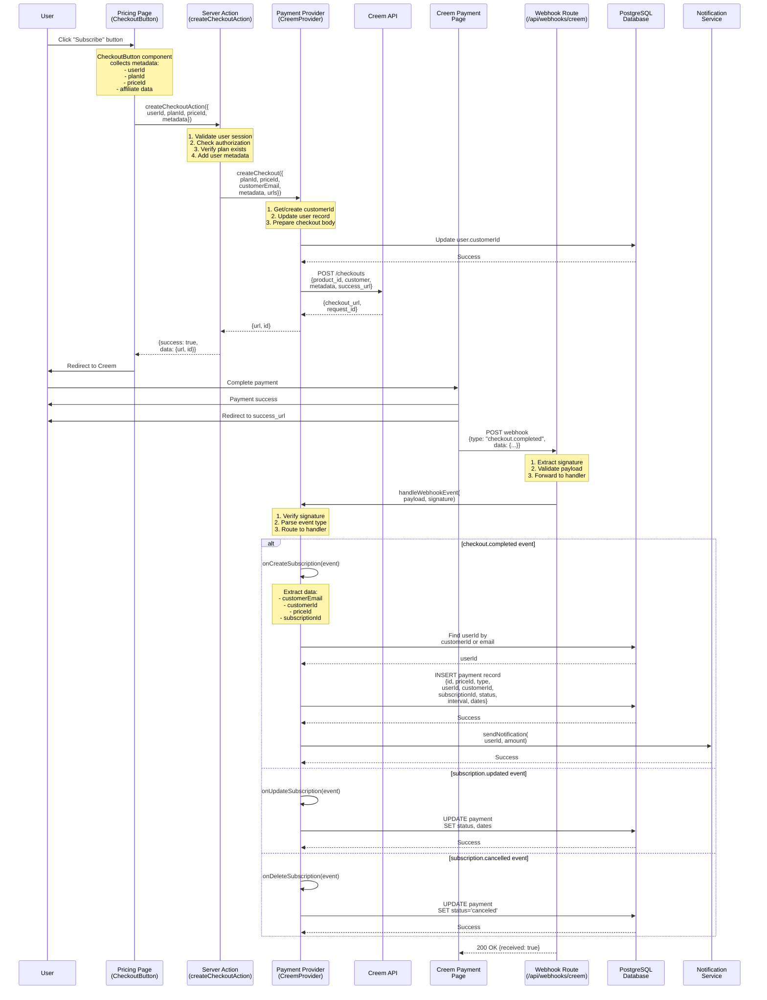

# Creem Subscription Flow Diagram

## Overview
This document illustrates the complete data flow for Creem subscription processing in the MKSaaS application.

## Sequence Diagram



## Data Flow Details

### 1. Checkout Initiation
- **Component**: `CheckoutButton` (client-side)
- **Data Collected**:
  - `userId`: Current user's ID
  - `planId`: Selected plan (free, pro, lifetime)
  - `priceId`: Specific price ID from environment variables
  - `metadata`: Additional data (affiliate referrals, etc.)

### 2. Server Action Processing
- **Action**: `createCheckoutAction`
- **Validations**:
  - User authentication check
  - Authorization (user can only checkout for themselves)
  - Plan existence verification
- **Data Enhancement**:
  - Adds `userId` and `userName` to metadata
  - Adds analytics tracking IDs if enabled
  - Generates localized success/cancel URLs

### 3. Payment Provider (CreemProvider)
- **Checkout Creation**:
  - Creates/retrieves customer ID (format: `creem_{email}`)
  - Updates user record with `customerId`
  - Prepares Creem API request with metadata
- **API Configuration**:
  - Test API: `https://test-api.creem.io/v1` (for test keys)
  - Production API: `https://api.creem.io/v1`
  - Authentication: Both `x-api-key` and `Authorization: Bearer` headers

### 4. Webhook Processing
- **Endpoint**: `/api/webhooks/creem/route.ts`
- **Signature Validation**:
  - Checks multiple header formats for signature
  - Validates using HMAC-SHA256 with webhook secret
  - Supports multiple signature formats (hex, base64, prefixed)
- **Event Types Handled**:
  - `checkout.completed`, `subscription.active`, `subscription.created`
  - `subscription.paid`, `subscription.updated`
  - `subscription.cancelled`, `subscription.deleted`
  - `payment.completed` (for one-time payments)

### 5. Database Schema
```sql
-- User table
user {
  id: text (primary key)
  email: text (unique)
  customerId: text
  ...
}

-- Payment table
payment {
  id: text (primary key)
  priceId: text
  type: text (subscription/one_time)
  interval: text (month/year)
  userId: text (foreign key)
  customerId: text
  subscriptionId: text
  status: text
  periodStart: timestamp
  periodEnd: timestamp
  cancelAtPeriodEnd: boolean
  trialStart: timestamp
  trialEnd: timestamp
  createdAt: timestamp
  updatedAt: timestamp
}
```

### 6. Status Mapping
- Creem statuses are mapped to internal payment statuses:
  - `active` → `active`
  - `cancelled`/`canceled` → `canceled`
  - `incomplete` → `incomplete`
  - `expired` → `incomplete_expired`
  - `past_due` → `past_due`
  - `trialing`/`trial` → `trialing`
  - `completed` → `completed`

### 7. Error Handling
- API errors are logged with full context
- Webhook processing continues even with signature validation failures (for debugging)
- User lookup attempts multiple methods (customerId, then email)
- Failed lookups trigger customerId update for future attempts

## Key Configuration

### Environment Variables
```bash
# Payment Provider
NEXT_PUBLIC_PAYMENT_PROVIDER=creem

# Creem API Configuration
CREEM_API_KEY=creem_test_xxx...  # or creem_live_xxx...
CREEM_WEBHOOK_SECRET=whsec_xxx...

# Price IDs
NEXT_PUBLIC_CREEM_PRICE_PRO_MONTHLY=price_xxx
NEXT_PUBLIC_CREEM_PRICE_PRO_YEARLY=price_yyy
NEXT_PUBLIC_CREEM_PRICE_LIFETIME=price_zzz
```

### Test Mode
- Test keys start with `creem_test_`
- Automatically uses test API endpoint
- Test webhook events can be simulated via `/api/test-creem-webhook`

## Security Considerations

1. **Authentication**: All checkout sessions require authenticated users
2. **Authorization**: Users can only create checkouts for themselves
3. **Webhook Validation**: Signature verification prevents replay attacks
4. **Data Integrity**: User IDs are stored in metadata and verified on webhook
5. **Customer Tracking**: Multiple fallback methods for user identification