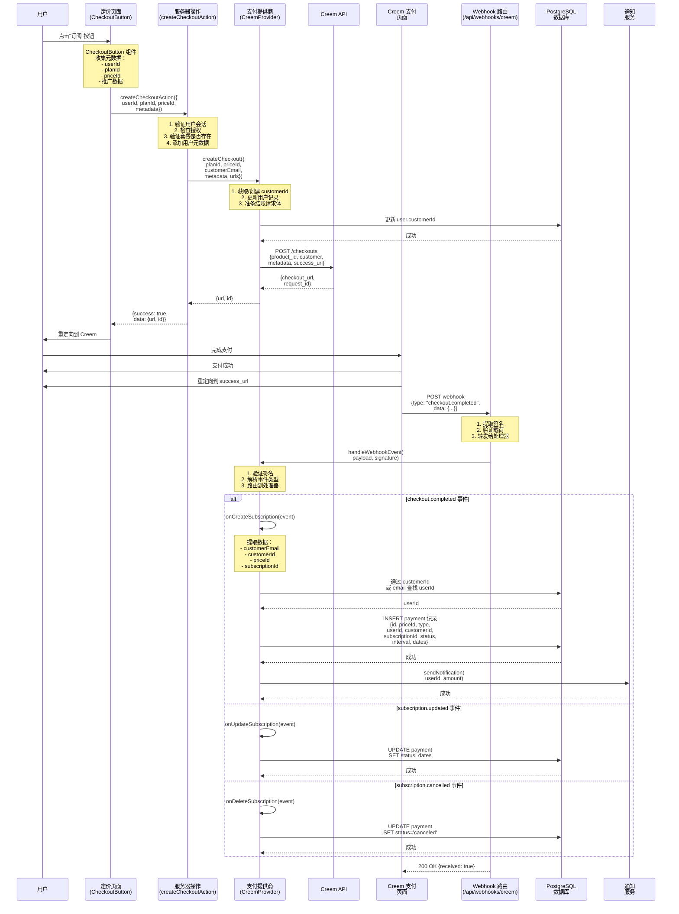

# Creem 订阅流程图

## 概述
本文档展示了 WATERMARKREMOVERTOOLS 应用程序中 Creem 订阅处理的完整数据流程。

## 时序图



## 数据流详情

### 1. 结账发起
- **组件**：`CheckoutButton`（客户端）
- **收集的数据**：
  - `userId`：当前用户 ID
  - `planId`：选择的套餐（free、pro、lifetime）
  - `priceId`：来自环境变量的特定价格 ID
  - `metadata`：附加数据（推广链接等）

### 2. 服务器操作处理
- **操作**：`createCheckoutAction`
- **验证**：
  - 用户身份验证检查
  - 授权（用户只能为自己结账）
  - 套餐存在性验证
- **数据增强**：
  - 将 `userId` 和 `userName` 添加到元数据
  - 如果启用，添加分析跟踪 ID
  - 生成本地化的成功/取消 URL

### 3. 支付提供商（CreemProvider）
- **结账创建**：
  - 创建/获取客户 ID（格式：`creem_{email}`）
  - 使用 `customerId` 更新用户记录
  - 准备带有元数据的 Creem API 请求
- **API 配置**：
  - 测试 API：`https://test-api.creem.io/v1`（用于测试密钥）
  - 生产 API：`https://api.creem.io/v1`
  - 认证：同时使用 `x-api-key` 和 `Authorization: Bearer` 头

### 4. Webhook 处理
- **端点**：`/api/webhooks/creem/route.ts`
- **签名验证**：
  - 检查多种头格式以获取签名
  - 使用 HMAC-SHA256 和 webhook 密钥进行验证
  - 支持多种签名格式（hex、base64、带前缀）
- **处理的事件类型**：
  - `checkout.completed`、`subscription.active`、`subscription.created`
  - `subscription.paid`、`subscription.updated`
  - `subscription.cancelled`、`subscription.deleted`
  - `payment.completed`（一次性付款）

### 5. 数据库架构
```sql
-- 用户表
user {
  id: text (主键)
  email: text (唯一)
  customerId: text
  ...
}

-- 支付表
payment {
  id: text (主键)
  priceId: text
  type: text (subscription/one_time)
  interval: text (month/year)
  userId: text (外键)
  customerId: text
  subscriptionId: text
  status: text
  periodStart: timestamp
  periodEnd: timestamp
  cancelAtPeriodEnd: boolean
  trialStart: timestamp
  trialEnd: timestamp
  createdAt: timestamp
  updatedAt: timestamp
}
```

### 6. 状态映射
- Creem 状态映射到内部支付状态：
  - `active` → `active`
  - `cancelled`/`canceled` → `canceled`
  - `incomplete` → `incomplete`
  - `expired` → `incomplete_expired`
  - `past_due` → `past_due`
  - `trialing`/`trial` → `trialing`
  - `completed` → `completed`

### 7. 错误处理
- API 错误记录完整上下文
- Webhook 处理即使签名验证失败也会继续（用于调试）
- 用户查找尝试多种方法（customerId，然后 email）
- 查找失败会触发 customerId 更新以供将来尝试

## 关键配置

### 环境变量
```bash
# 支付提供商
NEXT_PUBLIC_PAYMENT_PROVIDER=creem

# Creem API 配置
CREEM_API_KEY=creem_test_xxx...  # 或 creem_live_xxx...
CREEM_WEBHOOK_SECRET=whsec_xxx...

# 价格 ID
NEXT_PUBLIC_CREEM_PRICE_PRO_MONTHLY=price_xxx
NEXT_PUBLIC_CREEM_PRICE_PRO_YEARLY=price_yyy
NEXT_PUBLIC_CREEM_PRICE_LIFETIME=price_zzz
```

### 测试模式
- 测试密钥以 `creem_test_` 开头
- 自动使用测试 API 端点
- 可通过 `/api/test-creem-webhook` 模拟测试 webhook 事件

## 安全考虑

1. **身份验证**：所有结账会话都需要经过身份验证的用户
2. **授权**：用户只能为自己创建结账
3. **Webhook 验证**：签名验证防止重放攻击
4. **数据完整性**：用户 ID 存储在元数据中并在 webhook 时验证
5. **客户跟踪**：用户识别的多种回退方法